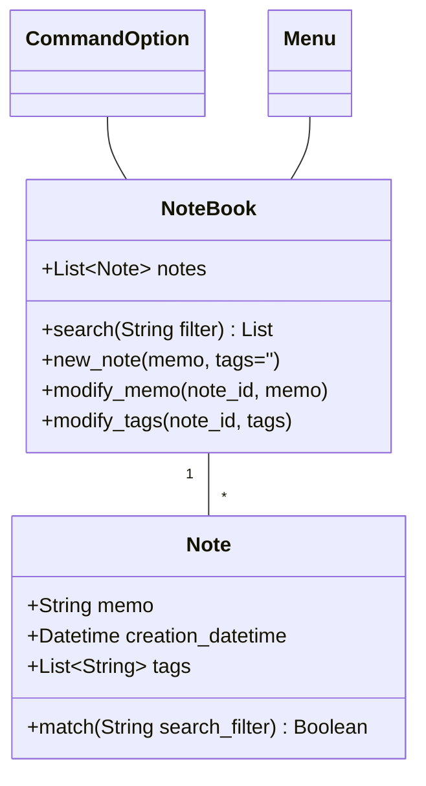

# Chapter02 - Case Study

This repository contains a case study for Chapter 2 of [Python-3-Object-Oriented-Programming-Second-Edition], showcasing various features and code examples.

## Table of Contents

- [Chapter02](#chapter02)
  - [Table of Contents](#table-of-contents)
  - [Introduction](#introduction)
  - [Project Structure](#project-structure)
  - [Key Differences](#key-differences)
  - [Acknowledgements](#acknowledgements)

## Introduction

## Project Structure

- `CaseStudy_Notebook` directory: This directory contains the main code for the case study.
  - `command_option.py`: Code related to command-line options.
  - `menu.py`: Code for creating a menu.
  - `model.py`: Code for the data model.
- `README.md`: This file, which serves as documentation for the project.

## Key Differences

In this case study, several key differences stand out:

* Model.py: The use of dataclass instead of the traditional __init__() method simplifies the creation of data models. This approach streamlines the code and improves readability.

* Notebook Object: Unlike conventional lists, I've opted for dictionaries in the Notebook object. Dictionaries, being hashtables, provide faster average read and write operations with `O(1)` complexity. This choice optimizes performance and efficiency for data retrieval and manipulation.

## Acknowledgements

Special thanks to the authors and contributors of [Python 3 Object-Oriented Programming - Third Edition](https://github.com/PacktPublishing/Python-3-Object-Oriented-Programming-Third-Edition) for their valuable insights and resources that have influenced and contributed to this case study.
